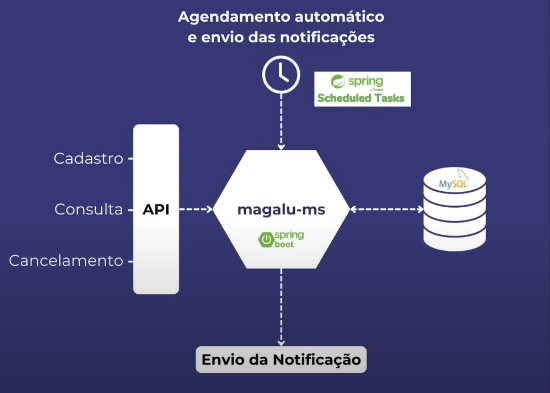

# About

We'll do a backend challenge of a company named: Magalu.

# What will we learn

- How to create a microservice with Spring Boot; 


- How to do schedule task with Spring Scheduler; 
    

- How to communicate with MySQL using Docker;


- Custom queries with Spring Data JPA;


- ManyToOne relations with JoinColumn


- Doing logs with SL4J

# About the challenge

The application will be part of a communication platform, so, we need:

- Receive a request to schedule notification sending


- Consult the situation of the notification schedule (to know if it was sended, is pending or has some error)


- Cancel a notification that has been schedule


# Technical requirements

- This API has to be Restfull


- The endpoint responsible for the schedule needs to have, at minimum, this attributes:
  - Date/Time that's going to be sent;
  - Receiver
  - Message to be delivered


- The possible ways to communicate (email, SMS, push and Whatsapp)


- As soon as we get the request of schedule, we have to save it in the database.

# Structure

```textmate
src/main/java/com/seuprojeto
├── application
│   ├── scheduler        # Lógica para agendamentos
│   └── usecases         # Casos de uso da aplicação
│       └── SendNotificationUseCase.java
├── domain
│   ├── entities         # Modelos centrais do domínio
│   │   └── Notification.java
│   ├── repositories     # Interfaces dos repositórios
│   │   └── NotificationRepository.java
│   └── services         # Regras de domínio puras
│       └── NotificationService.java
├── infrastructure
│   ├── config           # Configurações do projeto (Spring, Scheduler)
│   │   └── SchedulerConfig.java
│   ├── persistence      # Implementações do banco de dados (MySQL)
│   │   ├── JpaNotificationRepository.java
│   │   └── entities     # Representações das tabelas do banco
│   │       └── NotificationEntity.java
│   └── rabbitmq         # Comunicação com outras partes (opcional)
│       └── NotificationPublisher.java
└── interfaces
    ├── controllers      # Endpoints RESTful
    │   └── NotificationController.java
    ├── mappers          # Convertem entre entidades, DTOs e ViewModels
    └── dtos             # Objetos de entrada e saída da API
        ├── NotificationRequestDTO.java
        └── NotificationResponseDTO.java
```


## Initiating the project

- Spring Web
- Spring Data JPA
- Lombok for boilerplate code
- MySQL driver
- Docker compose support
- Spring Scheduled Tasks

# Initial Tasks

## MySQL and Docker configuration

```dockerfile
services:
  mysql:
    container_name: 'mysql-magalu'
    image: 'mysql:latest'
    environment:
      - 'MYSQL_DATABASE=magaludb'
      - 'MYSQL_PASSWORD=123'
      - 'MYSQL_ROOT_PASSWORD=123'
      - 'MYSQL_USER=admin'
    ports:
      - '3307:3306'
```

## Spring Boot with MySQL configuration

```properties
spring.application.name=desafio-mglu

spring.jpa.hibernate.ddl-auto=update
spring.datasource.url=jdbc:mysql://localhost:3307/magaludb
spring.datasource.username=root
spring.datasource.password=123
spring.datasource.driver-class-name=com.mysql.cj.jdbc.Driver
spring.jpa.show-sql=true
```

To connect on the database, we can use Workbench or Beekeeper.

<hr>

# Functionalities

## Scheduling notification with requests

### Mapping the entities (Notification, Channel and Status)

What do we need? First, we need to have the Notification. It'll be responsible to manage the date/time, recipient and the
message.

This notification is going to be sent through a Channel (another entity). This channel may be (email, SMS, push or Whatsapp).

And by last, we need to have the register status, if the notification was sent, we have to change the Status (ENUM).

#### Notification

Needs to have at least 3 attributes: date/time, recipient, message.

```java
```

#### Channel

```java
```

#### Status

```java
```

### Creating config to initialize the tables (Channel and Status)

A class can have predefined values, using ENUMS. On the bottom of the class, we can create a subclass ENUM.

It's going to be public and will return an ``enum``. It can be called "values".

Inside of it, we can return some ENUM values like: EMAIL, SMS, etc.

And we can also, create attributes on it like id, description and even constructors.

After that we can pass specific values to the ENUMS(id, description).

Finally, we can create inside this class a method to convert from ENUM to the class we are working with.

```java
```

To insert this predefined values, we can create class in the package config, named DataLoader.

#### DataLoader

This class will be responsible to initialize the database, so we need to create the repositories.

Since it's a configuration class, we use the @Configuration.

The class will implements CommandLineRunner, and we will implement the interface method. 

This method will be initialized as soon as we start our project. We need to guarantee that our tables has the values
predefined.

To do that, we have to insert our repositories (Channel & Status) and use the constructor.

Inside the method we have to persist the values using ``Entitie.Values.values()``. This will return an Array of values,
that we're going to convert to Stream. ``Arrays.stream(repository::save)``.

But this is still an ENUM, we need to convert to entity, so we use ``.map(Entitie.Values::METHOD)``.

```java
```

If we start the application, we should see on the logs the insertion on the tables.

### Creating the API to request the notification schedule

We are going to create a Controller class. The ideia is to have a POST method that's going to receive the schedule
request for the notification.

#### Controller

What do we need to request a notification? We need the date/time, the destination, the message and the channel. So that's
what our requestDTO will have (the channel has to point to the ENUM values).

Don't worry about the on ResponseEntity, leave it as ``<?>`` for now.

Let's go to our service layer. ➡️

#### Service

It's time to persist the request that came from the controller on the database.

We can't just save the request on the database, we need to convert to an entity. So, inside the DTO we create a method
that's capable to convert it.

```java
```

```java
```

#### Controller (Final)

Now, we just insert out Service and use the method.

We can use a void inside the ResponseEntity and return ``.accept().build()``.

### Create persistence flux of request

The flux was already created ⬆️.

Our application will receive the notification, it'll be saved on the database and we will return an "accept" (202).

### Testing the flux (api → service → mysql)

```http request
POST http://localhost:8080/notifications
```

```json
{
  "dateTime": "YYYY/MM/DDT1HH:MM:SS",
  "destination": "teste@test.com",
  "message": "Welcome!",
  "channel": "EMAIL"
}
```

<hr>

## Consulting the schedule notification situation

Create an endpoint that's capable of consulting the notification schedule that we created.

### Create notification schedule request query API (Controller)

We are going to search the notification by the ID.

Create the endpoint (GET).

```java
```

The return can be the ``Notification`` entity or a NotificationResponse (dto). Also, we can make a if to return ``notFound``,
on the Controller, or use the service for custom exception.

### Create request service (Service)

If we are going to return ``<Optional>Notification``, just a simple return repository method.

Or we can return the NotificationResponse (dto), converting from entity.

```java
```

### Testing the API

```http request
GET http://localhost:8080/notifications/{id}
```

<hr>

## Canceling the notification schedule

This is not a delete method, we are just going to change the status to "CANCELED".

### Create schedule notification cancellation API


```java
```

### Create service cancellation

Changing the enum to "CANCELED".

```java
```

### Test the API

```http request
DELETE http://localhost:8080/notifications/{id}
```

<hr>

## Checking if the notification was sended (Spring Scheduler)

[Read more about Spring Scheduler](https://spring.io/guides/gs/scheduling-tasks)

Let's remember the whole structure that we are working with to send the notification:



We already did the register (save, post method), the get (consulting method) and the cancellation! This is our microservice,
that is interacting with our database.

But let's think about something. **What if we scheduled to 10 minutes from now?** How does our microservice know when
to send this notification? That's when we are going to use the **Spring Scheduler**!

### Create checking routine via Spring Scheduler

This routine will work from time to time (like every minute if you want to), checking our database, verifying if there
is a PENDENT notification.

#### How to use it

Open the main application method, and insert ``@EnableScheduling``.

```java
@SpringBootApplication
@EnableScheduling
public class SchedulingTasksApplication {}
```

Now, we can create a package named ``scheduler`` with our class ``ExampleTaskScheduler``, this class is a @Component.

Create a method ``checkTasks``. To configure the time that he is going to run (every two minutes, for example), we can use
``@Scheduled(fixedDelay = 1, timeUnit = TimeUnit.MINUTES)`` < this he is going to run every minute.

This expression accepts a lots of values, like ``cron``.

After that, we can create a Logger do SLF4J; ``	private static final Logger log = LoggerFactory.getLogger(ScheduledTasks.class);``

And inside the method, we can inform the time that he is running: ``log.info("The time is now {}", dateFormat.format(new Date()));``

#### Testing the routine

If we run the application, we'll be able to see it in the console.

### Create Service to consult the available notifications to be sent

The ideia is to check the available notifications to be sent in a certain time. To do that, we have to search
in the database.

We are going to use a different method using JPA. We want 3 possible outcomes:

1. Notifications with PENDING status;
2. Notifications with ERROR status;
3. Notifications with Date before now.

This method needs to reference the attributes in our Entity. For example:

``findByStatusInAndDateTimeBefore``

Status is our attribute inside the Notification entity, same thing for the parameter dateTime! There's a dateTime
in there as well.

We can use a ``List.of`` the values inside the repository method and after, the dateTime.

After that we'll have the list of notifications (it can be inside a var), and we'll be able to send them (using forEach),
or something else, changing the STATUS.

**Remember to extract codes into methods.**

```java
```

### Create a mock that's able to send the notification with logging

Insert the notificationService inside the TaskScheduler, and use the service method inside the Task method.


### Test the complete flux (api -> schedule -> routine -> send the notification - updates the database)

Insert a notification with POST, set the time to one minute ahead.

Use the get method to check the STATUS

Use the get method again after 1 minute.

